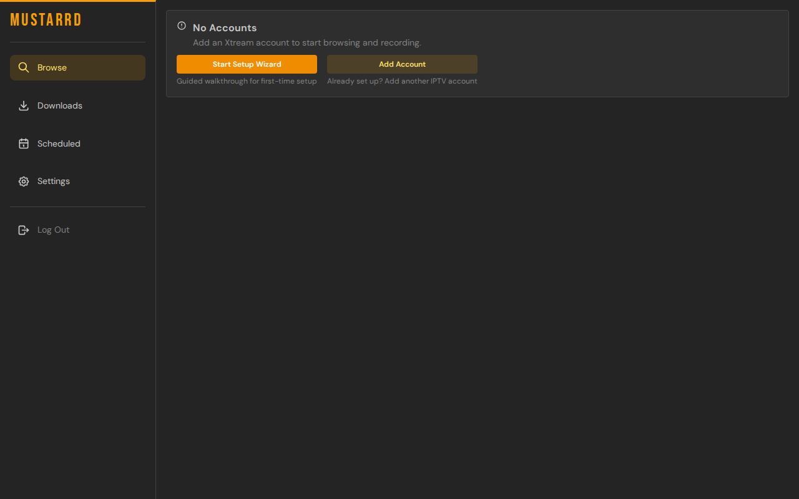
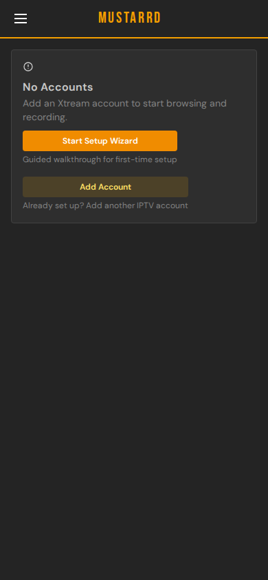
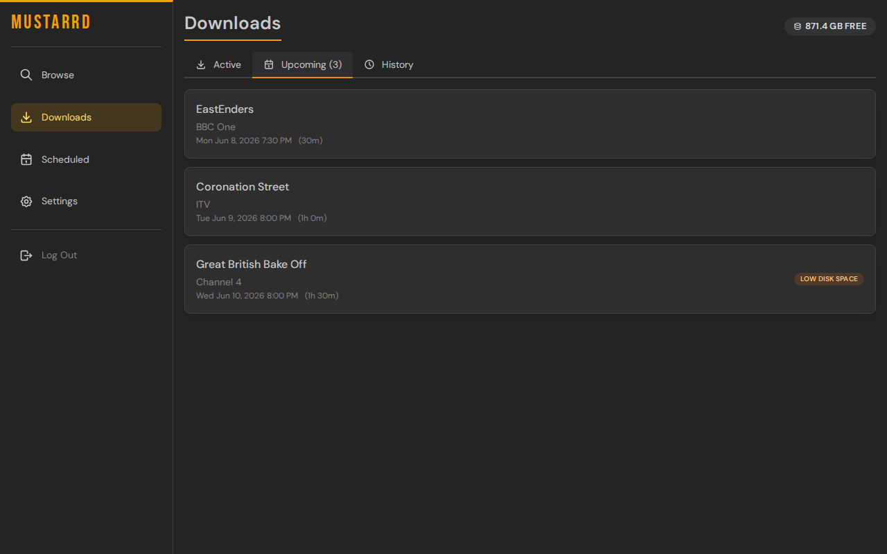
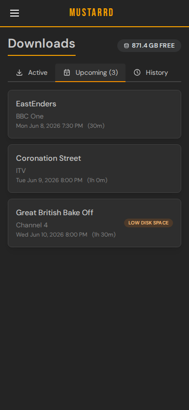
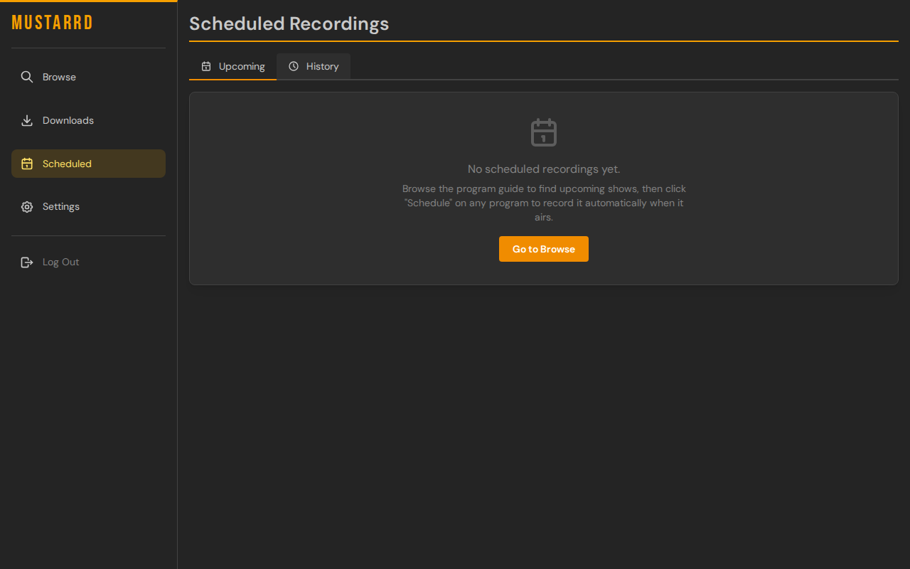
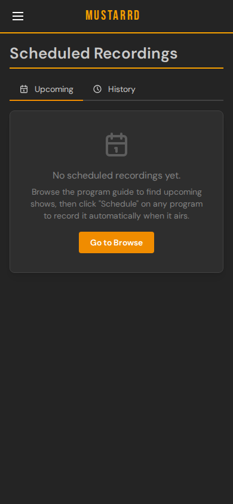
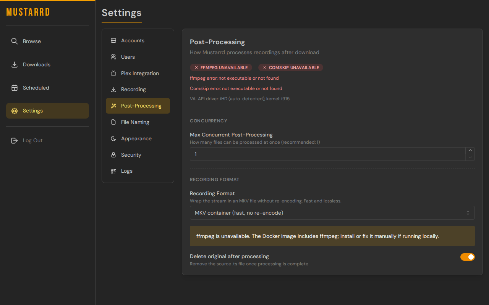
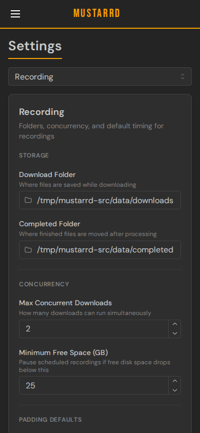

# Mustarrd: IPTV Catchup DVR

Mustarrd connects to your IPTV provider and lets you download past programs. Think of it as a DVR for your IPTV catchup library. Browse your provider's program guide, pick anything from the last few days (or schedule shows airing in the future), and download it with a properly named file ready for Plex, Jellyfin, or just your hard drive.

| Desktop | Mobile |
|---------|--------|
|  |  |

## Features

- **Browse past programs:** scroll back through your provider's program guide (EPG) and see what's available to download
- **Commercial skip:** ComSkip integration removes commercials before saving
- **Remux to MKV:** TS playback sucks. MKV is a much easier container to skip through
- **Download from On Demand:** If your provider provides on demand listings, you can grab those too!
- **Scheduled recordings:** set programs to download automatically when they air
- **Smart file naming:** TV shows, movies, and sports get automatically named in the right format (`Breaking Bad - S01E01 - Pilot.ts`, `The Matrix (1999).ts`, etc.)
- **Plex Link:** Allow your plex users to request programming by logging in with their Plex creds (or don't) and push recording directly to your TV recording library
- **Multiple accounts:** connect more than one IPTV provider. Add more users to give them download access

## Why Do I Need This? I have Sonarr...

- While Sonarr grabs the majority of quality programming out there I was searching for something for those random shows that air once a year. Think sports, awards shows, dog acrobatics competitions, the olympic games, etc.
- I hate commercials
- Sure, many good iptv players have the ability to record shows, but that is a recording of a recording. If something glitches, you're out of luck.
- Link it right to Plex (allow your users to add shows to download if you want using the Plex integration)

## Requirements

- An IPTV subscription with **catchup / timeshift support** (must use the Xtream Codes protocol)
- **Docker:** recommended install method, everything is bundled

> Not sure if your provider supports catchup? Check if they give you a "catchup days" value or mention timeshift in their plan details.

## Install

### Docker (Recommended)

Before first startup, edit the volume paths in `docker-compose.yml` so files go where you want on your host.
Update these host-side paths:

- `./config` (app settings/database)
- `./downloads` (working/in-progress files)
- `./completed` (final media output - I use a folder linked to a video library in Plex)


```bash
curl -O https://raw.githubusercontent.com/razzamatazm/mustarrd/main/docker-compose.yml
mkdir -p config downloads completed
docker compose up -d
```

Then open **http://localhost:4177** in your browser.

### Unraid

- Use image: `ghcr.io/razzamatazm/mustarrd/backend:latest`
- Community Apps template: [`unraid/mustarrd.xml`](./unraid/mustarrd.xml)
- Recommended mappings:
  - `/app/config` -> `/mnt/cache/appdata/mustarrd`
  - `/app/downloads` -> `/mnt/user/downloads/mustarrd`
  - `/app/completed` -> your media share (for example `/mnt/user/media`)
- Port mapping: container `4177` to host `4177` (or another host port if preferred)
- Optional hardware acceleration: map `/dev/dri` into the container
- Keep `PUID`/`PGID` aligned with your Unraid user that should own created files


## First Run

1. Open **http://localhost:4177**
2. You'll be prompted to **set an admin username and password**.
3. Enter your IPTV provider details:
   - Server URL (e.g. `https://your-provider.com`)
   - Username and password (from your provider)
4. Optional - link to your Plex install to allow request access to your plex users and automatic library scans on file completion.
5. Mustarrd will sync your provider's channel list and program guide to use in "Search All TV" mode. This takes a minute or two on first load. Individual channels will load instantly if you select one.
6. Go to **Browse**, pick a channel, and start downloading or search all.

## How to Use

### Browse and Download Programs

1. Go to **Browse** and select an account
2. Click a channel to open its program guide
3. Programs with a **mustard yellow border** have catchup available. Click one to open the download dialog
4. Review the auto-generated filename (edit if needed) and click **Download**

### Monitor Downloads

- Go to the **Downloads** page to see active downloads with progress bars
- The **Upcoming** tab lists everything scheduled to record automatically, sorted by air date, with show name, channel, time, and duration. A count badge on the tab heading shows how many recordings are queued at a glance. Recordings paused for low disk space show an orange badge explaining why
- A red badge on the **Downloads** menu item shows how many recordings have permanently failed since you last visited. Opening Downloads clears it
- A badge at the top shows how much free space is left on your recording drive. It turns red when space is low. If your recording drive is not found (for example after an array restart), the badge shows "Recording drive not found" in orange
- Failed downloads can be retried from the same page
- Use the **Clear finished** button to remove all completed and failed entries from history at once (a confirmation prompt prevents accidents; cancelled entries stay so you can retry them)

| Desktop | Mobile |
|---------|--------|
|  |  |

### Schedule a Recording

- Browse to an upcoming program and use the **Schedule** option to download it automatically when it airs
- Make sure to turn on the view future programming switch

| Desktop | Mobile |
|---------|--------|
|  |  |

## Smart Filename Detection

Mustarrd reads the program title and automatically formats the filename for your media library:

| Type | Example Output |
|------|----------------|
| TV Show (S01E01 pattern) | `Breaking Bad - S01E01 - Pilot.ts` |
| Sports | `NFL - Dolphins vs Chargers - 2026-01-28.ts` |
| Movie | `The Matrix (1999).ts` |
| Everything else | `ESPN - SportsCenter - 2026-01-28.ts` |

Filename templates are customizable in Settings if you want a different format.

## Where Your Files Go

| Folder | Contents |
|--------|----------|
| `./downloads/` | In-progress downloads and temp files used for ComSkip |
| `./completed/` | Finished files. Point this at your media library |
| `./config/` | Database, settings, and Comskip config. Keep this private |

Before first run, update the host paths in `docker-compose.yml` (`./config`, `./downloads`, `./completed`) to match your system.

## Configuration

Most users never need to touch these. Set them in `docker-compose.yml` or a `backend/.env` file.

| Desktop | Mobile |
|---------|--------|
|  |  |

| Variable | Description | Default |
|----------|-------------|---------|
| `CATCHUP_DEFAULT_DOWNLOAD_FOLDER` | In-progress download location | `/app/downloads` |
| `CATCHUP_DEFAULT_COMPLETED_FOLDER` | Finished file location | `/app/completed` |
| `CATCHUP_MAX_CONCURRENT_DOWNLOADS` | Max simultaneous downloads | `2` |
| `CATCHUP_SESSION_SECRET` | Session signing key, auto-generated and persisted to `./config/session_secret` on first run. Only set this manually to rotate or share across instances | *(auto)* |
| `CATCHUP_CORS_ORIGINS` | Comma-separated allowed frontend origins; only needed when the UI is accessed from a non-localhost address | `http://localhost:4178,...` |
| `CATCHUP_SESSION_HTTPS_ONLY` | Require HTTPS for session cookies | `true` |
| `CATCHUP_ALLOW_REMOTE_SETUP` | Allow password setup from non-local IPs | `false` |
| `CATCHUP_FFMPEG_PATH` | Path to ffmpeg binary | *(auto-detected)* |
| `CATCHUP_COMSKIP_PATH` | Path to comskip binary | *(auto-detected)* |
| `CATCHUP_DATABASE_URL` | SQLite database URL | `sqlite+aiosqlite:////app/config/catchup_dvr.db` |
| `CATCHUP_DEBUG` | Enable debug logging | `false` |

## Development

**Backend** (FastAPI, port 4177):
```bash
cd backend
python -m venv venv
source venv/bin/activate  # or `venv\Scripts\activate` on Windows
pip install -r requirements.txt
python main.py
```

**Frontend** (React + Vite, port 4178, proxies `/api` to 4177):
```bash
cd frontend
npm install
npm run dev
```

**Docker** (full stack):
```bash
docker-compose up -d
```

## License

MIT
